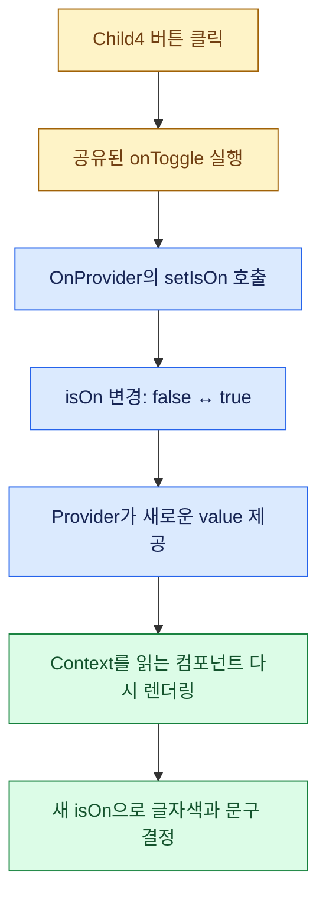

# useContext 학습 정리

> **2026.09.16 · 테마 변경 → isOn 공유 → 로그인 상태 공유**  
> 어제 문서: [useReducer 이해하기](USE_REDUCER_GUIDE.md)  
> VS Code에서 **Cmd + Shift + V**를 눌러 Markdown 미리보기로 읽어보세요.

| 표시 | 읽는 방법 |
| :--- | :--- |
| 🟦 **핵심** | 반드시 기억할 개념 |
| 🟨 **질문** | 오늘 헷갈렸던 부분 |
| 🟩 **답변** | 질문에 대한 설명 |
| 🟥 **주의** | 역할을 혼동하기 쉬운 부분 |

색상 표시는 뷰어마다 다를 수 있어서 아이콘, 굵은 글씨, 인용문, 표를 함께 사용했습니다. 아래의 색상 흐름도가 표시되지 않는 뷰어에서도 텍스트 구조도로 관계를 볼 수 있습니다. 앱 코드는 수정하지 않았으며, **현재 코드 설명**과 **연습용 예시**를 구분했습니다.

---

## 1. 먼저 기억할 한 문장

> 🟦 **useState가 상태를 관리하고, Provider가 값을 제공하고, useContext가 그 값을 읽는다.**

`useContext`는 여러 컴포넌트에서 필요한 값을, 중간 컴포넌트마다 props로 전달하지 않고 읽게 해주는 React Hook입니다.

| 기능 | 역할 | 오늘 예제 |
| :--- | :--- | :--- |
| `createContext` | 공유할 Context 객체 생성 | `OnContext` |
| `useState` | 실제 상태 보관과 변경 | `isOn`, `setIsOn` |
| `Context.Provider` | 아래 컴포넌트에 `value` 제공 | `{ isOn, onToggle }` |
| `useContext` | 가장 가까운 상위 Provider의 값 읽기 | `useContext(OnContext)` |
| 커스텀 Hook | Context 읽기와 null 검사를 재사용 | `useAuth()` |

**Context 객체 자체가 isOn 상태를 저장하는 것은 아닙니다.** 오늘 코드에서는 Provider 컴포넌트의 `useState`가 상태를 관리합니다.

---

## 2. 왜 사용하는가? 어떤 효과가 있는가?

로그인한 사용자 정보를 메뉴, 마이페이지, 프로필에서 모두 사용한다고 생각해보세요. props로 전달하면 그 정보가 필요 없는 중간 컴포넌트도 전달을 담당해야 할 수 있습니다. 이런 반복 전달을 **props drilling**이라고 합니다.

```text
props로 전달하는 경우
부모 → 중간 컴포넌트 → 중간 컴포넌트 → 실제로 값을 쓰는 자식
       전달만 담당      전달만 담당

Context를 사용하는 경우
Provider ────────────────→ 필요한 자식이 useContext로 읽음
         중간 컴포넌트가 props로 전달할 필요 없음
```

| 얻는 효과 | 예제에서 보이는 결과 |
| :--- | :--- |
| 반복적인 props 전달 감소 | Child3가 함수를 전달하지 않아도 Child4가 읽음 |
| 같은 상태를 여러 곳에서 사용 | 테마 버튼과 ThemeBox가 같은 테마 상태를 사용 |
| 상태 변경 방법 공유 | `setIsOn` 대신 `onToggle`을 제공해 변경 방법 통일 |
| 화면 간 사용자 정보 공유 | LoginForm이 저장한 id를 MyPage에서 읽을 수 있음 |

> 🟥 **Context의 주된 효과는 데이터 전달 구조를 정리하는 것입니다. 자동 성능 최적화나 서버 인증 기능이 생기는 것은 아닙니다.**

### 어떤 경우에 사용하면 좋은가?

| 상황 | 판단 |
| :--- | :--- |
| 여러 화면에서 로그인 사용자 정보가 필요함 | Context가 잘 맞음 |
| 여러 컴포넌트가 다크모드·언어 설정을 사용함 | Context가 잘 맞음 |
| 여러 단계 아래의 컴포넌트들이 같은 상태를 사용함 | Context를 고려 |
| 한 입력창의 입력값만 관리함 | 해당 컴포넌트의 useState로 충분 |
| 부모가 바로 아래 자식 하나에 값을 전달함 | props가 더 단순할 수 있음 |

Provider의 `value`가 달라지면 해당 Context를 읽는 컴포넌트들이 새 값을 반영하기 위해 다시 렌더링됩니다. 서로 관련 없는 상태를 거대한 Context 하나에 전부 넣을 필요는 없습니다.

---

## 3. 파일 관계를 한눈에 보기

### 역할별 지도

```text
CommonContext.ts
  └─ 타입 + OnContext 생성
           │ import
           ▼
OnProvider.tsx
  └─ useState + onToggle + Provider의 value
           │ import해서 JSX로 감쌈
           ▼
UseContextExam2.tsx
  └─ <OnProvider>
       <Child3 />
     </OnProvider>
           │ 렌더링 관계
           ▼
Child3.tsx
  ├─ Child3
  └─ Child4 → OnContext를 읽고 버튼 이벤트 연결
```

| 파일 | 담당할 일 | 연결 대상 |
| :--- | :--- | :--- |
| [CommonContext.ts](src/components/03-useContext/CommonContext.ts) | 공유 데이터 타입, Context, 공통 읽기 Hook | Provider와 값을 읽는 컴포넌트 |
| [OnProvider.tsx](src/components/03-useContext/OnProvider.tsx) | 상태와 변경 함수를 제공 | OnContext, children |
| [UseContextExam2.tsx](src/components/03-useContext/UseContextExam2.tsx) | Provider로 공유 범위를 지정 | OnProvider, Child3 |
| [Child3.tsx](src/components/03-useContext/Child3.tsx) | Child3와 그 자식 Child4의 화면 | 공유 상태, 이벤트 함수 |

> 🟦 **중요한 것은 파일 위치가 아니라 JSX의 부모·자식 관계입니다.**
> 같은 폴더에 있어도 Provider 밖에 있으면 그 Provider의 값을 읽을 수 없습니다. 서로 다른 파일이어도 Provider 안에서 렌더링되면 값을 읽을 수 있습니다.

Child3와 Child4는 현재 **같은 파일** 안에 있습니다. 컴포넌트마다 파일을 나눠야 하는 규칙은 없습니다. Child3에서 `<Child4 />`를 렌더링하므로 Child4는 Child3의 자식입니다.

### 색으로 보는 업데이트 흐름



**텍스트로 읽기:** 클릭 → 변경 함수 실행 → Provider 상태 변경 → 새 값 제공 → 사용하는 컴포넌트 렌더링 → 화면 갱신.

---

## 4. 구현 순서대로 이해하기

### ① CommonContext.ts — 무엇을 공유할지 정하기

```tsx
type OnContextType = {
  isOn: boolean;
  onToggle: () => void;
};

export const OnContext = createContext<OnContextType | null>(null);
```

`isOn`은 값이고, `onToggle`은 함수입니다. **Context에는 값뿐 아니라 함수도 전달할 수 있습니다.** `() => void`는 인자를 받지 않고 의미 있는 반환값을 사용하지 않는 함수 타입입니다.

`null`은 일치하는 Provider가 상위에 없을 때 읽게 되는 기본값입니다. `isOn`의 초기값은 여기서 정하지 않습니다.

### ② OnProvider.tsx — 실제 상태와 변경 방법 만들기

```tsx
const OnProvider = ({ children }: { children: ReactNode }) => {
  const [isOn, setIsOn] = useState(false);
  const onToggle = () => setIsOn((prev) => !prev);

  return (
    <OnContext.Provider value={{ isOn, onToggle }}>
      {children}
    </OnContext.Provider>
  );
};
```

위 코드는 핵심 구조를 보여주는 발췌입니다. 파일에서는 `useState`, `ReactNode`, `OnContext`를 import하고 컴포넌트를 export합니다.

| 표현 | 의미 |
| :--- | :--- |
| `useState(false)` | 처음 isOn은 false |
| `prev => !prev` | 이전 boolean 값을 반대로 변경 |
| `value={{ isOn, onToggle }}` | 값과 함수를 객체 하나로 제공 |
| `{children}` | OnProvider 태그 사이에 넣은 내용을 렌더링 |

> 🟨 **Q. 왜 `({ children }: ReactNode)`라고 쓰면 안 되나요?**
>
> 🟩 **A. props 전체는 객체이고, 그 안의 children이 ReactNode이기 때문입니다.**  
> `({ children }: { children: ReactNode })`라고 작성합니다.

### ③ UseContextExam2.tsx — 사용할 영역 감싸기

```tsx
<OnProvider>
  <Child3 />
</OnProvider>
```

이 구조에서 Child3뿐 아니라 그 자식 Child4도 값을 읽을 수 있습니다. Child3가 직접 Context를 읽지 않아도 Child4는 읽을 수 있습니다.

```text
OnProvider
└─ Child3       ← Context를 읽어도 되고, 안 읽어도 됨
   └─ Child4    ← 직접 Context를 읽을 수 있음
```

### ④ 자식 — 공유 값 읽기

```tsx
const context = useContext(OnContext);

if (!context) {
  throw new Error("OnContext is Null.");
}

const { isOn, onToggle } = context;
```

null 검사는 Provider 없이 사용한 경우를 찾아주고, TypeScript에도 검사 이후에는 값이 있다는 것을 알려줍니다.

### ⑤ 자식 — 상태를 화면과 이벤트에 연결하기

```tsx
const childStyle: React.CSSProperties = {
  color: isOn ? "#FF6B6B" : "#4DFAF4",
};

return (
  <div>
    <h2 style={childStyle}>Child4</h2>
    <button onClick={onToggle}>
      색상 변경 : {String(isOn)}
    </button>
  </div>
);
```

클릭 시 React가 `onToggle`을 호출합니다. 상태가 변경되면 다시 렌더링하면서 스타일 객체도 새 값에 맞춰 계산합니다. 색 변경을 위해 별도로 `useEffect`를 넣을 필요는 없습니다.

> 🟥 **`onClick={onToggle}`과 `onClick={onToggle()}`는 다릅니다.**  
> 앞은 클릭 때 실행할 함수를 전달합니다. 뒤는 렌더링 중 함수를 즉시 실행합니다.

---

## 5. 오늘 예제 세 가지 연결하기

| 예제 | Context | 상태를 관리하는 파일 | 공유 상태 | 공유 함수 | 읽는 쪽 |
| :--- | :--- | :--- | :--- | :--- | :--- |
| 테마 | ThemeContext | ThemeProvider.tsx | isDark | toggleTheme | ThemeToggleButton, ThemeBox |
| 숫자 증가 | CountContext | CountProvider.tsx | count | increaseCount | Child2 |
| 글자색 변경 | OnContext | OnProvider.tsx | isOn | onToggle | Child4 |

테마 예제에서는 버튼이 함수를 사용하고 ThemeBox가 상태로 색상을 결정합니다. isOn 예제에서는 현재 Child4가 **함수 실행과 글자색 표시를 모두 담당**합니다. 구조의 원리는 같습니다.

### 현재 코드에서 구분할 부분

- `Child2.tsx`에는 Child1과 Child2가 함께 있고, default export는 **Child1**입니다. 그래서 `import Child1 from "./Child2"`가 가능합니다.
- `Child3.tsx`에는 Child3와 Child4가 함께 있고, default export는 **Child3**입니다.
- 현재 Child3는 제목과 Child4를 렌더링합니다. 과제의 **“Child3에서 isOn 출력”은 아직 추가할 부분**입니다. Child3에서도 같은 Context를 읽어 `String(isOn)`을 표시하면 됩니다.
- 현재 `CommonContext.ts`의 **`useCount()`는 이름과 달리 OnContext를 읽습니다.** 따라서 반환값은 count가 아니라 isOn과 onToggle입니다. 동작은 내부 코드로 결정됩니다. 이름을 정리한다면 `useOn()`이 역할을 더 명확히 드러냅니다.

---

## 6. 커스텀 Hook으로 반복 줄이기

Context를 사용할 때마다 `useContext`와 null 검사를 쓰는 것이 반복되면 함수로 묶을 수 있습니다.

**이름을 역할에 맞춘 연습용 예시:**

```tsx
export function useOn() {
  const context = useContext(OnContext);

  if (!context) {
    throw new Error("OnProvider 안에서 사용해야 합니다.");
  }

  return context;
}
```

사용하는 쪽은 짧아집니다.

```tsx
const { isOn, onToggle } = useOn();
```

로그인 프로젝트의 `useAuth()`도 같은 패턴입니다.

> 🟨 **Q. useAuth()를 각 컴포넌트에서 호출하면 상태가 따로 생기나요?**
>
> 🟩 **A. 현재 useAuth는 새 상태를 만드는 함수가 아니라 AuthContext를 읽는 함수입니다.** 같은 Provider 아래에서 호출하면 같은 Provider가 제공한 값을 읽습니다.

> 🟥 **useContext, useAuth, useNavigate 같은 Hook은 컴포넌트 또는 커스텀 Hook의 최상위에서 호출합니다.** 이벤트 함수, 조건문, 반복문 안에서 호출하지 않습니다. Hook이 반환한 `login`, `navigate` 같은 함수는 이벤트 안에서 호출할 수 있습니다.

---

## 7. 로그인 예제로 확장하기 — 파일별 관계

로그인 프로젝트: [simple-auth-app](../simple-auth-app/)

```text
common/AuthContext.ts
  ├─ AuthContextType: 공유 데이터 모양
  ├─ AuthContext: 공유 통로
  └─ useAuth(): Context 읽기 + null 검사
          ▲                       ▲
          │ import                │ import
components/AuthProvider.tsx       components/LoginForm.tsx
  ├─ auth 상태                      ├─ form: 타이핑 중인 입력값
  ├─ login / logout                 ├─ useAuth로 login 가져오기
  └─ Provider의 value               └─ 검사 → login → navigate

main.tsx에서 실제 렌더링 구조 연결
AuthProvider
└─ BrowserRouter
   └─ App
      ├─ Navigation
      └─ Routes
         ├─ /login  → LoginForm
         └─ /mypage → MyPage
```

| 파일 | 역할 |
| :--- | :--- |
| [AuthContext.ts](../simple-auth-app/src/common/AuthContext.ts) | 공유 타입, Context, useAuth 정의 |
| [AuthProvider.tsx](../simple-auth-app/src/components/AuthProvider.tsx) | 로그인 상태와 login/logout 제공 |
| [main.tsx](../simple-auth-app/src/main.tsx) | 앱 전체를 AuthProvider와 BrowserRouter로 감쌈 |
| [LoginForm.tsx](../simple-auth-app/src/components/LoginForm.tsx) | 입력값 관리, 검사, login 호출, 페이지 이동 |
| [App.tsx](../simple-auth-app/src/App.tsx) | 주소에 맞는 컴포넌트 지정 |
| [Navigation.tsx](../simple-auth-app/src/components/Navigation.tsx) | 사용자가 클릭하는 이동 메뉴 |
| [MyPage.tsx](../simple-auth-app/src/components/MyPage.tsx) | 사용자 정보를 표시할 화면 |

이 구조에서는 LoginForm과 MyPage가 같은 AuthProvider 아래에 있습니다. 따라서 화면 이동으로 LoginForm이 사라져도 **위에 유지되는 AuthProvider의 상태**는 다른 화면에서 읽을 수 있습니다.

---

## 8. form과 auth는 다른 상태

| 구분 | LoginForm의 form | AuthProvider의 auth |
| :--- | :--- | :--- |
| 의미 | 입력 중인 내용 | 로그인 처리로 저장한 정보 |
| 변경 시점 | input의 onChange | login 또는 logout 호출 |
| 사용하는 범위 | 로그인 폼 내부 | Provider 아래에서 공유 |

> 🟦 **입력했다고 로그인 상태가 되는 것은 아닙니다. form에 입력하다가 login을 호출할 때 auth로 반영됩니다.**

```text
타이핑
  ↓
handleChange → setForm → 다시 렌더링
  ↓
const { id, password } = form 에 최신 렌더링 값 반영
  ↓
로그인 제출
  ↓
빈 입력 검사
  ↓
login(id, password) → Provider의 setAuth
  ↓
navigate('/mypage') → 화면 이동
```

> 🟨 **Q. 컴포넌트 위에서 꺼낸 id는 처음의 빈 문자열 아닌가요?**
>
> 🟩 **A. 컴포넌트가 다시 렌더링할 때 구조 분해 코드도 다시 실행됩니다.** `onChange`에서 form을 갱신하므로, 입력 후 제출 이벤트에서는 최신 렌더링의 값을 사용합니다. 단, `setForm`을 호출한 바로 그 함수 안에서 기존 변수를 읽는다고 즉시 새 값이 되지는 않습니다.

> 🟨 **Q. 제출할 때 e.target.value에서 id와 password를 가져와야 하나요?**
>
> 🟩 **A. 현재 코드는 form 상태에 이미 입력값을 관리하므로 그 값을 쓰면 됩니다.** 폼 제출 이벤트의 `e.target.value`에 두 입력값이 객체로 모여 있는 것은 아닙니다.

---

## 9. login은 무엇을 하고, 비교는 어디서 하나?

현재 AuthProvider의 함수는 다음과 같습니다.

```tsx
const login = (id: string, password: string) => setAuth({ id, password });
const logout = () => setAuth({ id: "", password: "" });
```

로그인 여부는 다음처럼 계산합니다.

```tsx
isLoggedIn: auth.id !== ""
```

> 🟨 **Q. login이라는 함수가 알아서 아이디와 비밀번호를 비교하나요?**
>
> 🟩 **A. 아닙니다. login은 개발자가 붙인 함수 이름입니다.** 현재 구현은 받은 값을 상태에 저장할 뿐이고, 계정 비교나 서버 요청은 없습니다. 빈 값 검사를 통과한 입력을 로그인 정보로 저장하는 연습입니다.

| 코드 | 역할 |
| :--- | :--- |
| `const { login } = useAuth()` | 공유된 함수 가져오기 |
| `login(id, password)` | 함수를 호출해서 상태 변경 요청 |
| `if (!id.trim() || !password.trim()) ...` | 입력이 비었거나 공백뿐인지 검사 |
| 계정의 id/password와 비교 | 입력 검사와는 별개의 인증 과정 |

비교를 연습하려면 가상 계정과 일치할 때만 login을 호출하는 조건을 추가할 수 있습니다. **실제 서비스에서는 서버가 인증을 검증합니다.** 현재 예제의 비밀번호 상태 저장과 id 유무 검사는 서버 인증을 대신하는 구현이 아닙니다.

---

## 10. useNavigate는 Context와 별개의 역할

| 기능 | 역할 | 실행 시점 |
| :--- | :--- | :--- |
| `Route` | 주소와 화면을 연결 | 주소에 맞는 화면을 렌더링할 때 |
| `Link` / `NavLink` | 클릭으로 이동할 링크 표시 | 사용자가 링크를 클릭할 때 |
| `useNavigate()` | 코드로 이동할 함수 가져오기 | 컴포넌트 최상위에서 호출 |
| `navigate('/mypage')` | 지정한 주소로 이동 | 로그인 처리 뒤 등 필요한 시점 |

현재 LoginForm의 핵심 흐름은 이미 다음과 같이 연결되어 있습니다.

```tsx
// 컴포넌트 최상위
const context = useAuth();
const navigate = useNavigate();

const handleLogin = (e: React.SubmitEvent) => {
  e.preventDefault();

  if (!id.trim() || !password.trim()) {
    alert("아이디나 비밀번호를 확인해주세요");
    return;
  }

  const { login } = context;
  login(id, password);
  navigate("/mypage");
};
```

> 🟨 **Q. 마이페이지로 가는 메뉴가 있는데 왜 navigate도 필요한가요?**
>
> 🟩 **A. 메뉴는 클릭하면 이동하고, navigate는 로그인 처리 직후 코드에서 이동하기 때문입니다.** `Route`를 등록했다고 로그인 직후 자동 이동하는 것은 아닙니다.

`navigate`가 로그인 상태를 만드는 것도 아니고, `login`이 페이지를 이동시키는 것도 아닙니다. 오늘 코드에서는 두 함수를 순서대로 호출합니다. 현재 login은 동기적으로 상태 변경을 요청하는 함수입니다. 나중에 서버 요청을 넣으면 인증 성공 응답을 확인한 후 이동하는 흐름이 필요합니다.

---

## 11. 자주 헷갈리는 질문과 답변

> 🟨 **Q. Context는 앱 전체에서 무조건 쓸 수 있나요?**
>
> 🟩 **A. 제공한 값은 해당 Provider의 자손에서 읽습니다.** 같은 Context의 Provider가 여러 개라면 가장 가까운 상위 Provider를 사용합니다. 동일한 Provider 컴포넌트를 두 번 배치하면 각각의 useState는 별도 상태입니다.

> 🟨 **Q. Child4가 상태를 바꾸면 Child3도 바뀌나요?**
>
> 🟩 **A. Child3도 같은 Context를 읽고 그 값으로 화면을 만들면 함께 갱신됩니다.** 단지 부모라는 이유만으로 isOn 출력 코드가 자동으로 생기는 것은 아닙니다.

> 🟨 **Q. 왜 화면에 `{isOn}`만 쓰면 true/false가 안 나오나요?**
>
> 🟩 **A. React는 boolean 값을 텍스트로 표시하지 않습니다.** `{String(isOn)}` 또는 `{isOn ? "켜짐" : "꺼짐"}`으로 표시합니다.

> 🟨 **Q. useReducer와 useContext 중 하나를 골라야 하나요?**
>
> 🟩 **A. 역할이 달라 함께 사용할 수 있습니다.** useReducer로 상태 변경 규칙을 관리하고, Provider로 state와 dispatch를 전달한 뒤 자식에서 useContext로 읽을 수 있습니다.

| 기능 | 기억할 역할 |
| :--- | :--- |
| useState | 상태 관리 |
| useReducer | 상태 관리 + 변경 규칙을 reducer로 정리 |
| useContext | Provider가 제공한 값 읽기 |
| useNavigate | 코드에서 페이지 이동할 함수 가져오기 |

> 🟨 **Q. Context로 로그인하면 새로고침해도 유지되나요?**
>
> 🟩 **A. Context 자체는 저장 기능이 아닙니다.** 현재 useState에만 저장된 정보는 앱을 새로 로드하면 초기값으로 돌아갑니다.

---

## 12. 직접 구현할 때의 순서

1. **공유할 값 결정:** isOn인가, count인가, 사용자 정보인가?
2. **타입과 Context 생성:** 공유할 값과 함수의 모양 정의.
3. **Provider 작성:** useState 또는 useReducer로 상태 관리.
4. **value 제공:** 자식에게 필요한 값과 변경 함수 전달.
5. **공유 범위 지정:** 필요한 컴포넌트를 Provider로 감싸기.
6. **자식에서 읽기:** useContext 또는 커스텀 Hook 사용.
7. **화면과 이벤트 연결:** 상태로 화면을 그리고, 이벤트에서 변경 함수 호출.

## 13. 복습 질문

- [ ] createContext, Provider, useContext의 역할을 각각 말할 수 있다.
- [ ] 같은 폴더에 있는 것과 같은 Provider 아래에 있는 것의 차이를 안다.
- [ ] Child3를 거쳐 props를 전달하지 않아도 Child4가 값을 읽는 이유를 안다.
- [ ] 현재 useCount가 실제로 어떤 Context를 읽는지 설명할 수 있다.
- [ ] form과 auth의 변경 시점을 구분할 수 있다.
- [ ] 함수를 꺼내는 것과 호출하는 것의 차이를 안다.
- [ ] 입력 검사, 인증, 로그인 상태 저장, 페이지 이동을 구분할 수 있다.
- [ ] Hook을 이벤트 함수 안에서 호출하면 안 된다는 것을 안다.

<details>
<summary>🟩 답 확인하기</summary>

1. Context 객체 생성 / 값 제공 / 제공한 값 읽기입니다.
2. 공유 범위는 파일 위치가 아니라 렌더링 트리의 Provider로 결정됩니다.
3. Context는 중간 컴포넌트의 props 전달 없이 상위 Provider를 찾아 읽습니다.
4. 현재 useCount의 내부 코드는 OnContext를 읽으므로 isOn과 onToggle을 반환합니다.
5. form은 타이핑할 때, auth는 login/logout을 호출할 때 변경합니다.
6. `const { login } = context`는 참조를 꺼내고, `login(id, password)`는 실행합니다.
7. 빈 값 검사 / 계정 확인 / auth 업데이트 / navigate 호출은 각각 다른 역할입니다.
8. Hook은 컴포넌트 또는 커스텀 Hook 최상위에서 호출하고, 반환된 이벤트용 함수는 이벤트에서 실행할 수 있습니다.

</details>

> 🟦 **기억할 문장: 상태는 Provider에서 관리하고, 필요한 자식은 Context로 읽고, 공유된 함수로 변경을 요청한다.**
