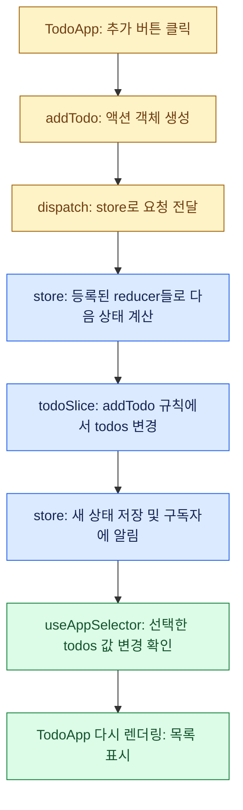

# Redux 학습 정리

> **2026.09.17 · 카운터 → 댓글 → Todo로 배우는 Redux Toolkit**  
> 어제 문서: [useContext 학습 정리](../react05-global-state/USE_CONTEXT_GUIDE.md)  
> 연결해서 읽기: [useReducer 이해하기](../react05-global-state/USE_REDUCER_GUIDE.md)  
> VS Code에서 **Cmd + Shift + V**로 Markdown 미리보기를 열어보세요.

| 표시 | 읽는 방법 |
| :--- | :--- |
| 🟦 **핵심** | 반드시 기억할 개념 |
| 🟨 **질문** | 오늘 헷갈렸던 부분 |
| 🟩 **답변** | 질문에 대한 설명 |
| 🟥 **주의** | 역할을 혼동하기 쉬운 부분 |

어제와 같은 형식으로 핵심 박스, 질문·답변, 표, 색상 흐름도를 사용했습니다. Mermaid를 지원하지 않는 뷰어에서도 텍스트 구조도로 관계를 읽을 수 있습니다. **현재 프로젝트를 기준으로 정리했으며 앱 코드는 수정하지 않았습니다.** 코드 블록은 설명에 필요한 부분을 발췌한 것입니다.

---

## 1. 먼저 기억할 한 문장

> 🟦 **slice에서 변경 규칙을 만들고 → store에 등록하고 → Provider로 제공하고 → 컴포넌트가 상태를 읽고 dispatch로 변경을 요청한다.**

Redux는 앱의 상태를 store에서 관리하는 도구입니다. 오늘 사용하는 **Redux Toolkit**은 `configureStore`, `createSlice` 등으로 Redux 작성 과정을 간단하게 해줍니다. **React Redux**는 React 컴포넌트와 store를 연결합니다.

| 가져오는 곳 | 오늘 사용하는 기능 | 역할 |
| :--- | :--- | :--- |
| `@reduxjs/toolkit` | configureStore, createSlice, PayloadAction | store와 변경 규칙 생성, 액션 타입 지정 |
| `react-redux` | Provider, useSelector, useDispatch | React에서 store 제공·조회·요청 |
| `react` | useState | 입력 중인 내용 등 컴포넌트 내부 상태 |
| `react-router-dom` | Routes, Route, BrowserRouter | 주소와 화면 연결 |

Redux가 화면 이동까지 담당하는 것은 아닙니다. **Redux는 상태, Router는 페이지 이동**을 담당합니다.

---

## 2. 왜 사용하고, 어떤 경우에 좋은가?

| 상황 | 얻는 효과 |
| :--- | :--- |
| 여러 화면에서 같은 상태를 사용 | props를 여러 단계 전달하지 않고 공통 상태에 접근 |
| 등록·삭제·완료 등 변경 종류가 많음 | 기능별 slice에 변경 규칙을 정리 |
| 상태 변경 원인을 추적하고 싶음 | 액션 이름과 payload로 어떤 요청이 있었는지 확인 |
| TypeScript로 데이터 구조를 확인하고 싶음 | state와 action의 타입을 연결해 오류 발견 |

카운터만 있는 작은 화면에서는 useState로도 충분합니다. 오늘 예제는 작은 기능으로 Redux 연결을 연습하는 것입니다. 장바구니, 여러 화면에서 사용하는 편집 데이터처럼 **공유 범위와 변경 규칙이 커질 때** Redux의 구조가 도움이 됩니다.

> 🟥 **모든 상태를 Redux에 넣을 필요는 없습니다.** 현재 TodoApp도 입력 중인 글은 useState로 관리하고, 등록된 목록은 Redux로 관리합니다. Redux가 자동으로 새로고침 후 상태를 보존하거나 서버에 저장해주는 것도 아닙니다.

### 어제 배운 것과 비교

| 기능 | 담당 역할 |
| :--- | :--- |
| useState | 컴포넌트 상태 관리 |
| useReducer | 컴포넌트 상태와 변경 규칙 관리 |
| useContext | Provider가 제공한 값 읽기 |
| Redux + React Redux | store에서 상태·액션·reducer를 연결하고 React 화면에서 사용 |

Context와 useReducer를 함께 사용해 공통 상태를 관리할 수도 있습니다. Redux는 여기에 store, 액션 처리 방식, 미들웨어, 개발 도구 등 정해진 구조를 제공합니다.

---

## 3. 구성요소와 실제 파일 대응표

| 구성요소 | 의미 | 현재 파일과 코드 |
| :--- | :--- | :--- |
| State | 현재 데이터 | store의 `myTodo.todos`, `myComment.comments` 등 |
| Initial state | 시작 상태 | 각 Slice 파일의 `initialState` |
| Slice | 기능별 초기 상태·변경 규칙을 묶은 단위 | todoSlice.ts의 `createSlice(...)` |
| Reducer | 상태와 액션으로 다음 상태를 계산 | 각 Slice 파일의 `.reducer` |
| Action | 무슨 작업인지와 데이터를 담은 요청 객체 | `addTodo("공부")`가 만든 객체 |
| Action creator | 액션을 만드는 함수 | Slice에서 export한 `addTodo`, `updateTodo` 등 |
| Store | 전체 상태 보관, 액션 처리와 구독 연결 | store.ts의 `configureStore(...)` |
| Provider | React 트리에 store 제공 | main.tsx의 `<Provider store={store}>` |
| Selector | 전체 상태에서 필요한 부분을 선택하는 함수 | TodoApp.tsx의 `(state) => state.myTodo.todos` |
| Dispatch | 액션을 store에 보내는 함수 | TodoApp.tsx의 `dispatch(addTodo(contents))` |
| Typed hooks | store 타입을 적용한 React Redux Hook | hooks.ts의 useAppSelector, useAppDispatch |

**함수·객체·타입 구분:** `store`와 `action`은 객체, `dispatch`와 액션 생성 함수는 함수, `RootState`와 `PayloadAction`은 TypeScript 타입입니다.

---

## 4. 실제 파일 지도

```text
src/
├─ main.tsx                      앱 실행 + Provider로 store 제공
├─ App.tsx                       주소에 따라 화면 선택
├─ store.ts                      기능별 reducer 등록
├─ hooks.ts                      타입이 지정된 Redux Hook
├─ features/counter/
│  ├─ counterSlice.ts            카운터 변경 규칙
│  └─ ReduxBasicApp.tsx          카운터 화면
├─ comments/
│  ├─ commentsSlice.ts           댓글 변경 규칙
│  └─ CommentsApp.tsx            댓글 화면
└─ todo/
   ├─ todoSlice.ts               Todo 변경 규칙
   └─ TodoApp.tsx                Todo 화면
```

| 파일 | 주요 함수·요소 | 연결 대상 |
| :--- | :--- | :--- |
| [todoSlice.ts](src/todo/todoSlice.ts) | createSlice, addTodo, updateTodo, deleteTodo, clearTodo | reducer는 store로, 액션 생성 함수는 TodoApp으로 |
| [store.ts](src/store.ts) | configureStore, RootState, AppDispatch | store는 main으로, 타입은 hooks로 |
| [main.tsx](src/main.tsx) | createRoot, Provider, BrowserRouter | store를 받아 App 전체에 제공 |
| [hooks.ts](src/hooks.ts) | useSelector.withTypes, useDispatch.withTypes | store 타입을 받아 화면용 Hook 내보내기 |
| [TodoApp.tsx](src/todo/TodoApp.tsx) | useAppSelector, useAppDispatch, useState | 상태 읽기, 액션 전달, JSX 표시 |
| [App.tsx](src/App.tsx) | Routes, Route | `/todos` 주소와 TodoApp 연결 |
| [commentsSlice.ts](src/comments/commentsSlice.ts) | createSlice, addComment, deleteComment, clearComment | 댓글 reducer와 액션 생성 함수 제공 |
| [CommentsApp.tsx](src/comments/CommentsApp.tsx) | useAppSelector, useAppDispatch, useState | 댓글 화면과 이벤트 |
| [counterSlice.ts](src/features/counter/counterSlice.ts) | createSlice, increment, decrement, reset | 카운터 reducer와 액션 생성 함수 제공 |
| [ReduxBasicApp.tsx](src/features/counter/ReduxBasicApp.tsx) | useAppSelector, useAppDispatch | 카운터 화면과 이벤트 |

### import / export 연결 구조

```text
todoSlice.ts
  │
  ├─ default export: todoSlice.reducer
  │       ↓ import todoReducer
  │    store.ts
  │       ├─ default export: store ─────────→ main.tsx의 Provider
  │       └─ export type: RootState, AppDispatch
  │                          ↓
  │                       hooks.ts
  │                          ├─ useAppSelector ──┐
  │                          └─ useAppDispatch ──┤
  │                                             ↓
  └─ export: addTodo, updateTodo 등 ─────────→ TodoApp.tsx
                                                ↑
                                    App.tsx가 /todos에서 렌더링
```

> 🟦 **파일을 import하는 연결과, 실행 중 Provider에서 store를 읽는 연결은 구분하세요.** hooks.ts는 store의 타입을 가져오지만, 실제 store는 컴포넌트 위의 Provider를 통해 React Redux Hook이 찾습니다.

---

## 5. todoSlice.ts — 초기 상태와 변경 규칙

### ① 타입과 초기 상태

```tsx
interface Todo {
  idx: number;
  contents: string;
  done: boolean;
}

interface TodoState {
  todos: Todo[];
}

export const initialState: TodoState = {
  todos: [],
};
```

`Todo`는 할 일 한 개의 모양이고, `TodoState`는 이 slice가 관리하는 전체 상태의 모양입니다. 상태는 배열 자체가 아니라 **todos 배열을 속성으로 가진 객체**입니다.

### ② createSlice로 규칙 묶기

```tsx
const todoSlice = createSlice({
  name: "myTodos",
  initialState,
  reducers: {
    addTodo: (state, action: PayloadAction<string>) => {
      state.todos.push({
        idx: Date.now(),
        contents: action.payload,
        done: false,
      });
    },
    updateTodo: (state, action: PayloadAction<number>) => {
      const todo = state.todos.find((todo) => todo.idx === action.payload);
      if (todo) {
        todo.done = !todo.done;
      }
    },
    deleteTodo: (state, action: PayloadAction<number>) => {
      state.todos = state.todos.filter((todo) => todo.idx !== action.payload);
    },
    clearTodo: (state) => {
      state.todos = [];
    },
  },
});
```

| 규칙 | payload | 의미 |
| :--- | :--- | :--- |
| addTodo | 문자열 contents | 할 일 추가 |
| updateTodo | 숫자 idx | 일치하는 할 일의 완료 여부 반전 |
| deleteTodo | 숫자 idx | 일치하는 할 일 삭제 |
| clearTodo | 없음 | 전체 삭제 |

이 안의 `state`는 전체 store가 아니라 **Todo slice의 상태**입니다. 따라서 `state.todos`로 읽습니다.

### ③ 두 종류의 export

```tsx
export const { addTodo, updateTodo, deleteTodo, clearTodo } = todoSlice.actions;
export default todoSlice.reducer;
```

| export | 받는 파일 | 용도 |
| :--- | :--- | :--- |
| `todoSlice.reducer` | store.ts | 상태 변경 규칙으로 등록 |
| `todoSlice.actions`에서 꺼낸 함수 | TodoApp.tsx | dispatch에 전달할 액션 생성 |

> 🟨 **Q. reducers 안의 addTodo와 export한 addTodo는 같은 함수인가요?**
>
> 🟩 **A. 역할이 다릅니다.** reducers 안의 함수는 상태 변경 규칙이고, `todoSlice.actions.addTodo`는 Toolkit이 만들어준 액션 생성 함수입니다. 이름을 연결해 만들어주지만, 컴포넌트가 reducer를 직접 실행하는 것은 아닙니다.

```tsx
addTodo("Redux 복습");
// 다음 요청 객체를 생성
// { type: "myTodos/addTodo", payload: "Redux 복습" }
```

---

## 6. store.ts — reducer 등록과 전체 상태 구성

```tsx
import todoReducer from "./todo/todoSlice";

const store = configureStore({
  reducer: {
    myCounter: counterReducer,
    myComment: commentReducer,
    myTodo: todoReducer,
  },
});
```

전체 초기 상태는 다음과 같은 모양입니다.

```tsx
{
  myCounter: { value: 0 },
  myComment: { comments: [] },
  myTodo: { todos: [] }
}
```

**store의 키가 selector의 접근 경로를 결정합니다.**

```text
state.myTodo.todos
      ────── ─────
      store  slice 초기 상태의 속성
      등록 키
```

| 이름 | 정의 위치 | 사용 목적 |
| :--- | :--- | :--- |
| `myTodo` | store.ts의 reducer 키 | `state.myTodo`로 상태 접근 |
| `myTodos` | todoSlice.ts의 name | `myTodos/addTodo` 같은 액션 타입 생성 |
| `todoReducer` | store.ts의 import 이름 | 가져온 reducer를 가리키는 변수 |

이 세 이름이 반드시 같아야 하는 것은 아닙니다. 역할을 구분하는 것이 중요합니다.

```tsx
export type RootState = ReturnType<typeof store.getState>;
export type AppDispatch = typeof store.dispatch;
export default store;
```

`RootState`는 getState가 반환하는 전체 상태 타입이고, `AppDispatch`는 이 store의 dispatch 타입입니다. **타입 선언은 실행 중 데이터를 복사하거나 별도 상태를 만드는 코드가 아닙니다.**

---

## 7. main.tsx — Provider로 앱에 store 제공

```tsx
import { Provider } from "react-redux";
import store from "./store.ts";

createRoot(document.getElementById("root")!).render(
  <Provider store={store}>
    <BrowserRouter>
      <App />
    </BrowserRouter>
  </Provider>,
);
```

```text
Provider : store 제공
└─ BrowserRouter : 라우터 기능 제공
   └─ App
      └─ 선택된 화면
         ├─ ReduxBasicApp
         ├─ CommentsApp
         └─ TodoApp
```

상태는 store에 있고, Provider는 React 컴포넌트들이 그 store를 찾도록 연결합니다. Provider 밖에서는 해당 store에 연결된 React Redux Hook을 사용할 수 없습니다.

---

## 8. hooks.ts — 타입이 지정된 읽기·요청 Hook

```tsx
import { useDispatch, useSelector } from "react-redux";
import type { AppDispatch, RootState } from "./store";

export const useAppDispatch = useDispatch.withTypes<AppDispatch>();
export const useAppSelector = useSelector.withTypes<RootState>();
```

| Hook | 반환하거나 읽는 것 | 화면에서의 사용 |
| :--- | :--- | :--- |
| useAppSelector | selector가 선택한 상태 값 | `state.myTodo.todos` 읽기 |
| useAppDispatch | dispatch 함수 | `dispatch(addTodo(contents))` |

이 파일은 store를 추가로 만들지 않습니다. **기존 Hook에 우리 앱의 타입을 적용해서 내보내는 파일**입니다. 그래서 화면에서 `state`에 어떤 속성이 있는지 TypeScript가 알 수 있습니다.

> 🟨 **Q. useAppDispatch()를 호출하면 reducer가 실행되나요?**
>
> 🟩 **A. 이 호출은 dispatch 함수를 가져옵니다.** 실제 변경 요청은 `dispatch(addTodo(...))`에서 보냅니다. `const dispatch = useAppDispatch()` 자체가 댓글이나 Todo를 추가하지는 않습니다.

---

## 9. TodoApp.tsx — 읽기, 입력, 변경 요청, 표시

### ① 필요한 Hook과 액션 생성 함수 가져오기

```tsx
import { useState } from "react";
import { useAppDispatch, useAppSelector } from "../hooks";
import { addTodo, clearTodo, deleteTodo, updateTodo } from "./todoSlice";
```

### ② Redux 상태와 지역 상태 구분

```tsx
const todos = useAppSelector((state) => state.myTodo.todos);
const dispatch = useAppDispatch();
const [contents, setContents] = useState("");
```

| 변수 | 저장 위치 | 변경 시점 |
| :--- | :--- | :--- |
| contents | TodoApp의 useState | textarea에 입력할 때 |
| todos | Redux store의 myTodo | Todo 액션을 dispatch할 때 |

`useAppSelector` 안의 `state`는 **전체 store 상태**입니다. slice의 reducer 안에서 받는 `state`와 범위가 다릅니다.

### ③ 추가 버튼

```tsx
onClick={() => {
  dispatch(addTodo(contents));
  setContents("");
}}
```

1. addTodo가 입력 내용을 payload로 가진 액션을 만듭니다.
2. dispatch가 store에 액션을 보냅니다.
3. reducer가 목록에 할 일을 추가합니다.
4. setContents가 입력창을 비웁니다.

### ④ 완료 체크박스

```tsx
<input
  type="checkbox"
  checked={todo.done}
  onChange={() => dispatch(updateTodo(todo.idx))}
/>

<span className={todo.done ? "line-through" : ""}>
  {todo.contents}
</span>
```

**상태에서 화면으로:** done → checked와 취소선.  
**화면에서 요청으로:** 체크박스 조작 → idx를 담아 dispatch → reducer가 done 반전.

### ⑤ 삭제와 전체 삭제

```tsx
dispatch(deleteTodo(todo.idx));
dispatch(clearTodo());
```

Todo 하나를 삭제하려면 식별 번호가 필요하지만, 전체 삭제는 별도 payload가 필요 없습니다.

---

## 10. App.tsx — 주소와 화면 연결

```tsx
<Route path="/redux-basic" element={<ReduxBasicApp />} />
<Route path="/comments" element={<CommentsApp />} />
<Route path="/todos" element={<TodoApp />} />
```

App.tsx가 화면을 선택하면 해당 컴포넌트가 Hook으로 store를 읽습니다. App.tsx에서 todos를 props로 내려줄 필요는 없습니다.

> 🟦 **Route에 화면을 등록하는 일과 store에 reducer를 등록하는 일은 별개입니다.**  
> App.tsx에는 `<TodoApp />`, store.ts에는 `todoReducer`를 연결합니다.

---

## 11. 실행 흐름을 한눈에 보기



```text
TodoApp.tsx
  dispatch(addTodo("Redux 복습"))
             ↓
  { type: "myTodos/addTodo", payload: "Redux 복습" }
             ↓
store.ts에서 생성한 store
  등록된 reducer들이 액션 처리
  해당 액션에 맞는 Todo 변경 규칙 실행
             ↓
todoSlice.ts
  state.todos에 새 항목 추가
             ↓
store의 myTodo.todos 변경
             ↓
TodoApp.tsx
  useAppSelector가 선택한 값 변경 → 렌더링 → todos.map으로 표시
```

다른 slice는 처리할 규칙이 없는 액션에 대해 기존 상태를 유지합니다. store의 키가 특정 액션을 한 reducer에만 배달하는 주소는 아닙니다.

---

## 12. 카운터·댓글·Todo 대응표

| 항목 | 카운터 | 댓글 | Todo |
| :--- | :--- | :--- | :--- |
| slice 파일 | counterSlice.ts | commentsSlice.ts | todoSlice.ts |
| 화면 파일 | ReduxBasicApp.tsx | CommentsApp.tsx | TodoApp.tsx |
| store 키 | myCounter | myComment | myTodo |
| 읽는 상태 | myCounter.value | myComment.comments | myTodo.todos |
| 추가·증가 | increment() | addComment(contents) | addTodo(contents) |
| 삭제·감소 | decrement() | deleteComment(id) | deleteTodo(idx) |
| 초기화·전체 삭제 | reset() | clearComment() | clearTodo() |
| 완료 여부 변경 | 없음 | 없음 | updateTodo(idx) |

기능이 달라도 **slice → store → Provider → Hook → 화면**의 구조는 같습니다. 새 기능을 추가할 때 복사한 액션 이름과 상태 경로가 남아 있지 않은지 확인하세요.

---

## 13. 오늘 오류와 질문 정리

> 🟨 **Q. store.ts에서 commentsSlice import에 오류가 났던 이유는?**
>
> 🟩 **A. 실제 파일은 src/comments에 있는데 features/comments에서 찾았기 때문입니다.** 현재는 `import commentReducer from "./comments/commentsSlice"`로 연결되어 있습니다. `./`는 현재 파일이 있는 폴더를 기준으로 합니다.

> 🟨 **Q. TodoApp의 state.myTodo.todos 타입이 이상했던 이유는?**
>
> 🟩 **A. store에서 todoSlice 대신 TodoApp 컴포넌트를 reducer로 가져왔기 때문입니다.** 현재는 `import todoReducer from "./todo/todoSlice"`로 수정되어 있습니다. 화면을 반환하는 컴포넌트와 상태를 계산하는 reducer는 역할이 다릅니다.

> 🟨 **Q. contents, setContents, addComment 등에 오류가 났던 이유는?**
>
> 🟩 **A. 입력 상태 선언이 빠졌고, 댓글 예제의 액션 이름이 남아 있었기 때문입니다.** 현재 TodoApp에는 useState가 있고, addTodo와 clearTodo도 올바르게 연결되어 있습니다.

> 🟨 **Q. `todo.idx = !action.payload`는 왜 타입 오류인가요?**
>
> 🟩 **A. 숫자 idx에 boolean 값을 대입하기 때문입니다.** 찾을 때는 `todo.idx === action.payload`, 완료 여부를 바꿀 때는 `todo.done = !todo.done`을 사용합니다. 현재 코드는 수정되어 있습니다.

| 표현 | 의미 | 적용 예 |
| :--- | :--- | :--- |
| `=` | 대입 | `todo.done = true` |
| `===` | 같은지 비교 | 찾을 때 idx 비교 |
| `!==` | 다른지 비교 | 삭제할 항목을 제외할 때 |
| `!` | 참·거짓 반전 | done 토글 |

> 🟨 **Q. id를 new Date로 바꾸면 댓글 시간이 나오나요?**
>
> 🟩 **A. 현재 id가 Date.now()로 생성되므로 가능합니다.** 현재 CommentsApp은 다음 코드로 생성 당시 시각을 표시합니다.

```tsx
new Date(comment.id).toLocaleTimeString("ko-KR")
```

날짜까지 표시하려면 `toLocaleString("ko-KR")`을 사용할 수 있습니다. 숫자 id를 날짜로 읽을 수 있는 것은 **현재 id를 타임스탬프로 만들었기 때문**입니다. 모든 id가 날짜인 것은 아닙니다. 나중에는 식별자와 등록 시간을 `id`, `createdAt`으로 분리할 수 있습니다.

> 🟨 **Q. Redux에서는 push나 직접 대입을 해도 되나요?**
>
> 🟩 **A. createSlice의 reducer 안에서는 Immer가 제공하는 draft를 수정하는 방식으로 작성할 수 있습니다.** Immer가 새 상태를 만들어 불변성을 유지합니다. 컴포넌트에서 selector로 읽은 배열에 직접 push해도 된다는 뜻은 아닙니다.

> 🟨 **Q. dispatch 다음 줄의 todos는 바로 새 배열인가요?**
>
> 🟩 **A. 일반 액션의 store 업데이트는 동기적으로 처리되지만, 컴포넌트의 todos 변수는 그 렌더링에서 읽은 값입니다.** 다음 렌더링에서 새 값을 읽습니다.

---

## 14. 현재 예제에서 다음에 개선해볼 부분

### 시간과 식별자 생성 위치

현재 댓글·Todo reducer는 `Date.now()`로 번호를 생성합니다. 동작 흐름을 배우기에는 간단하지만 **reducer는 같은 상태와 액션에 같은 결과를 내는 순수한 계산**으로 두는 것이 원칙입니다.

개선할 때는 이벤트 처리 또는 createSlice의 `prepare`에서 시간·식별자를 생성하고 payload로 보내면 됩니다. 같은 밀리초에 생성한 항목의 번호가 겹칠 수 있으므로 고유 id와 createdAt을 따로 두는 것도 고려할 수 있습니다. 현재 코드는 변경하지 않았습니다.

### 빈 내용 추가 방지

현재 추가 버튼은 빈 문자열도 dispatch합니다. 입력 검사를 연습한다면 추가 전에 `if (!contents.trim()) return;` 같은 검사를 넣을 수 있습니다.

### 상태 유지 범위

앱 안에서 Router로 화면만 바꾸면 store가 유지되므로 등록 목록도 유지됩니다. 브라우저 새로고침으로 앱이 다시 로드되면 현재 예제의 store는 초기 상태로 시작합니다. 영구 저장은 별도 구현입니다.

---

## 15. 새 기능을 만들 때의 순서

1. **타입 정의:** 항목 하나와 slice 상태의 모양 결정.
2. **slice 생성:** initialState와 변경 규칙 작성.
3. **export:** 액션 생성 함수와 reducer 내보내기.
4. **store 등록:** reducer를 import하고 상태 키 지정.
5. **Provider 확인:** 앱이 기존 Provider 안에 있는지 확인. 기능마다 새 Provider를 만들 필요는 없음.
6. **화면 작성:** useAppSelector로 읽고 useAppDispatch로 요청 함수 준비.
7. **이벤트 연결:** dispatch(actionCreator(payload)).
8. **Route 연결:** 필요하면 App.tsx에서 새 화면 경로 등록.

기존 hooks.ts는 store에서 타입을 유추하므로, store에 정상적으로 등록한 새 상태도 같은 Hook으로 읽을 수 있습니다.

## 16. 복습 질문

- [ ] slice에서 내보내는 reducer와 액션 생성 함수가 각각 어느 파일로 가는지 안다.
- [ ] store의 myTodo와 slice의 name인 myTodos의 차이를 안다.
- [ ] Provider와 hooks.ts가 각각 어떤 역할인지 설명할 수 있다.
- [ ] addTodo를 호출하는 것과 dispatch하는 것의 차이를 안다.
- [ ] slice의 state와 selector의 state가 가리키는 범위를 구분한다.
- [ ] contents는 useState, todos는 Redux에 두는 이유를 설명할 수 있다.
- [ ] 체크박스의 checked와 onChange가 각각 어떤 방향으로 연결되는지 안다.
- [ ] store에는 TodoApp이 아니라 todoReducer를 등록해야 하는 이유를 안다.

<details>
<summary>🟩 답 확인하기</summary>

1. reducer는 store.ts로, 액션 생성 함수는 이벤트를 처리하는 화면으로 갑니다.
2. myTodo는 상태 경로, myTodos는 액션 타입의 접두사입니다.
3. Provider는 실제 store를 제공하고, hooks.ts는 우리 store의 타입을 적용한 Hook을 제공합니다.
4. addTodo는 액션 객체를 만들고, dispatch는 그 객체를 store로 보냅니다.
5. slice의 state는 해당 기능 상태, selector의 state는 전체 store 상태입니다.
6. 입력 중인 값은 현재 화면에서 사용하고, 등록 목록은 store에서 관리하기 때문입니다.
7. checked는 상태를 화면에 반영하고, onChange는 화면의 조작을 변경 요청으로 전달합니다.
8. 컴포넌트는 화면을 반환하고, reducer는 상태와 액션으로 다음 상태를 계산하기 때문입니다.

</details>

> 🟦 **기억할 문장: 컴포넌트는 액션을 보내고, reducer는 다음 상태를 계산하고, store는 상태를 보관하고, selector는 화면에 필요한 값을 읽는다.**
